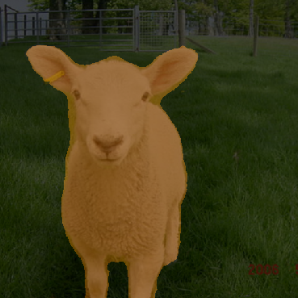

# SegTrack system on uterine tumor

## Part1 DeepLabv3Plus

### Segentationtation Result on Pascal2012

<div>


</div>

<div>



</div>

<div>


</div>

## Part2 YOLOv7

### Object Detection on Random image 

<div>
    
</div>

### Muti-Object Tracking

<div>

<div>

## Part3 Dataset

### DaVinci datasets

<div>


<div>

### Bash
```bash
python predict.py --seg_mod deeplab  --model deeplabv3plus_effiformer_s2 --ckpt pretrained/best_deeplabv3plus_effiformer_s2_voc_os8.pth --yolo_dataset davinci --weight pretrained/best.pt --source videos/video1 --crop_val
```

### Demo

<div>

<div>
